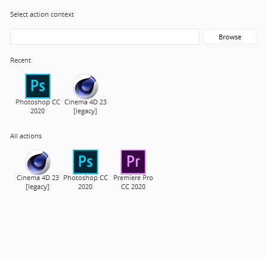
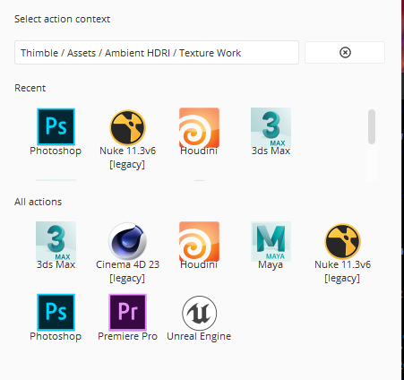
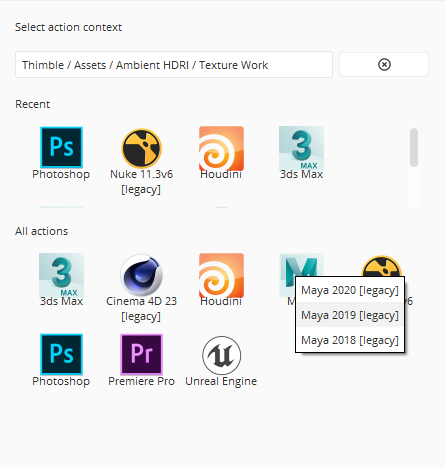

#####
Using
#####

Launching applications
======================

As well as common actions, Application launchers can be bound to none, one or more Context.

Is therefore important to remember to select one in order to discover new applications and integrations.

Selecting integrations
----------------------

Each application can request one or more integrations to run, the name of the group will appear next to the version.

